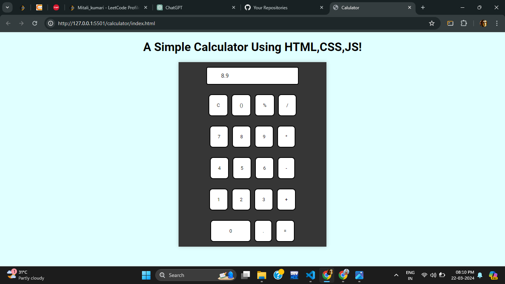

# Simple HTML, CSS, and JavaScript Calculator

A simple calculator built using HTML, CSS, and JavaScript. This calculator allows basic arithmetic operations such as addition, subtraction, multiplication, and division.

## Preview



## Features

- Basic arithmetic operations: Addition (+), Subtraction (-), Multiplication (*), Division (/)
- Additional functionalities: Clear (C), Percentage (%)
- Responsive design
- Beautifully styled buttons

## Installation

1. Clone the repository:

    ```bash
    git clone https://github.com/yourusername/calculator.git
    ```

2. Open `index.html` in your web browser.

## Usage

1. Enter numbers and perform calculations using the provided buttons.
2. Use the "C" button to clear the input field.
3. Use the "%" button to calculate percentages.
4. Press "=" to see the result of your calculation.

## Customization

Feel free to customize the calculator's styles by modifying the `style.css` file. You can change colors, fonts, and layout to suit your preferences.

## Contributing

Contributions are welcome! If you'd like to improve this calculator or fix any issues, please open a pull request or submit an issue on GitHub.

## License

This project is licensed under the [MIT License](LICENSE).

## Acknowledgements

- [Font Awesome](https://fontawesome.com/) for button icons
- [Google Fonts](https://fonts.google.com/) for font styles

